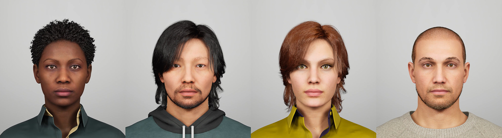

# Anonymous Panda

`Anonymous Panda` is a thesis project designed to facilitate communication and expressionism for patients who want to remain anonymous during their mental health consultations.

---

## Prerequisites

- Unreal Engine >= 4.26
- iPhone with TrueDepth Sensor
- Ultraleap Gemini >= 5.3.1
- Leap Motion Controller

---

## Usage

You simply need to download this project by:

    1. Clicking "Clone or download"
    2. Clicking "Download ZIP"

After that, simply open it in the unreal engine and you're good to go!

---

## Testing

If you just want to test the face and/or hand tracking, just download it through the following link, [Anonymous Panda](https://drive.google.com/file/d/1H4jWYfx_ht4MLTdJh3VENhw3I01xFUt5/view?usp=sharing)

After that, simply open the .exe file and you're ready to go!

> **_NOTE:_**  Don't forget to have your iPhone with the correct ip address and the leap motion properly turned on and with the plugins installed correctly!
